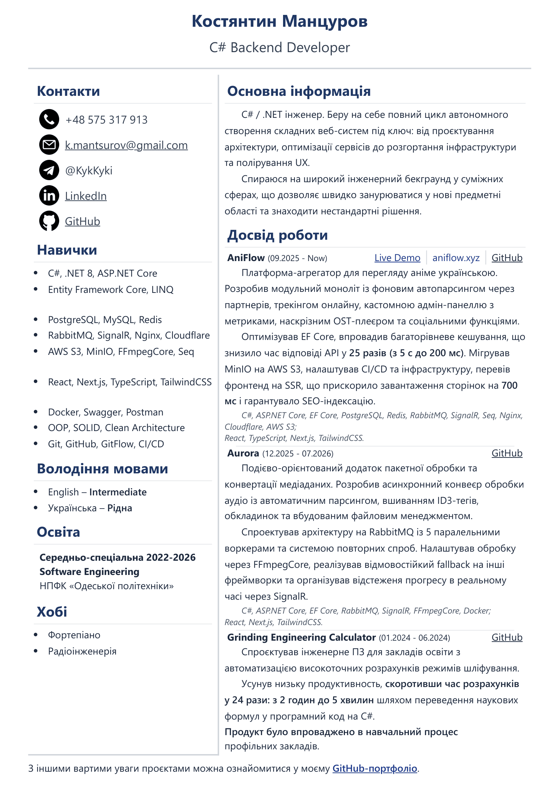

# 📄 CV – Kostiantyn Mantsurov

---

## 🛠️ Застосовую технології

<!-- Backend -->

 <!-- C# -->
 <!-- ASP.NET Core -->
 <!-- PostgreSQL -->
 <!-- MySQL -->
 <!-- Redis -->
 <!-- RabbitMQ -->
 <!-- SignalR -->
 <!-- Nginx -->
 <!-- Cloudflare -->
 <!-- AWS S3 -->
 <!-- MinIO -->
 <!-- Seq -->
 <!-- React -->
 <!-- Next.js -->
 <!-- TypeScript -->
 <!-- TailwindCSS -->
 <!-- Docker -->
 <!-- Swagger -->
 <!-- Postman -->
 <!-- Git -->
 <!-- GitHub -->

## ❔ Про себе

C# / .NET інженер із 2-річним досвідом.
Беру на себе повний цикл автономного створення складних веб-систем під ключ: від проєктування архітектури, оптимізації сервісів до розгортання інфраструктури та полірування UX.

Спираюся на широкий інженерний бекграунд у суміжних сферах, що дозволяє
швидко занурюватися у нові предметні області та знаходити нестандартні рішення.
